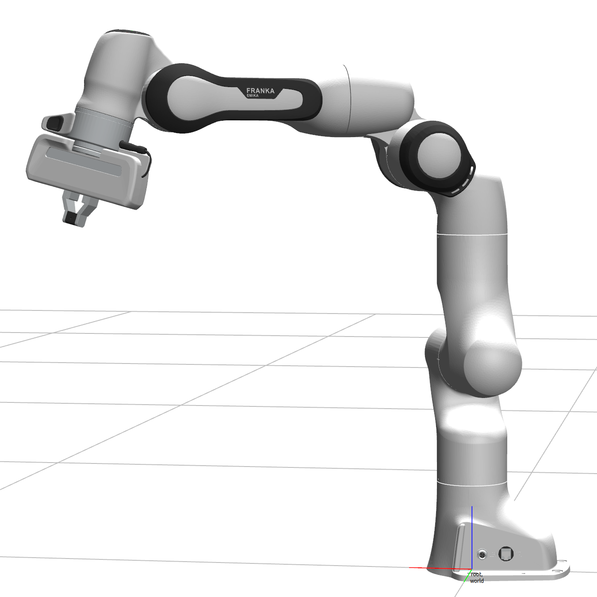
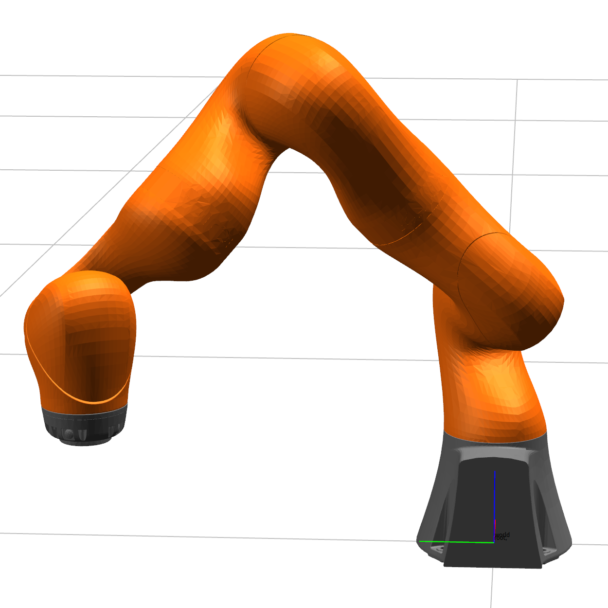
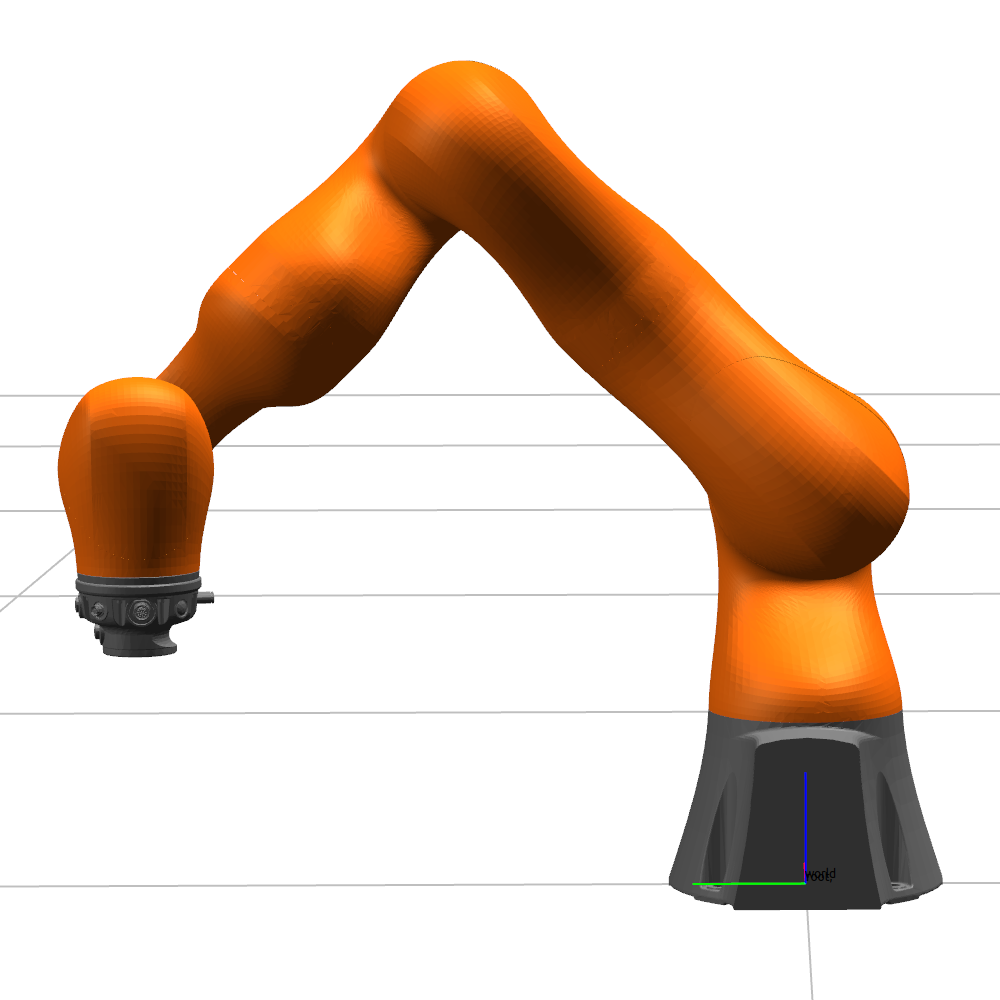
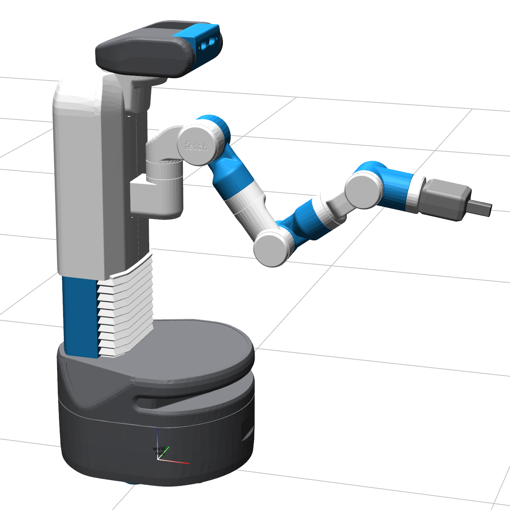
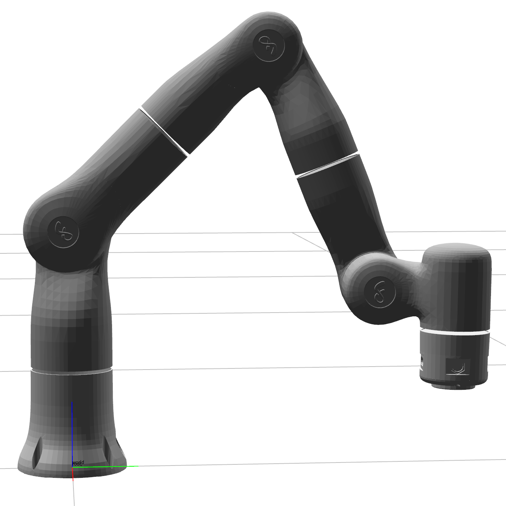
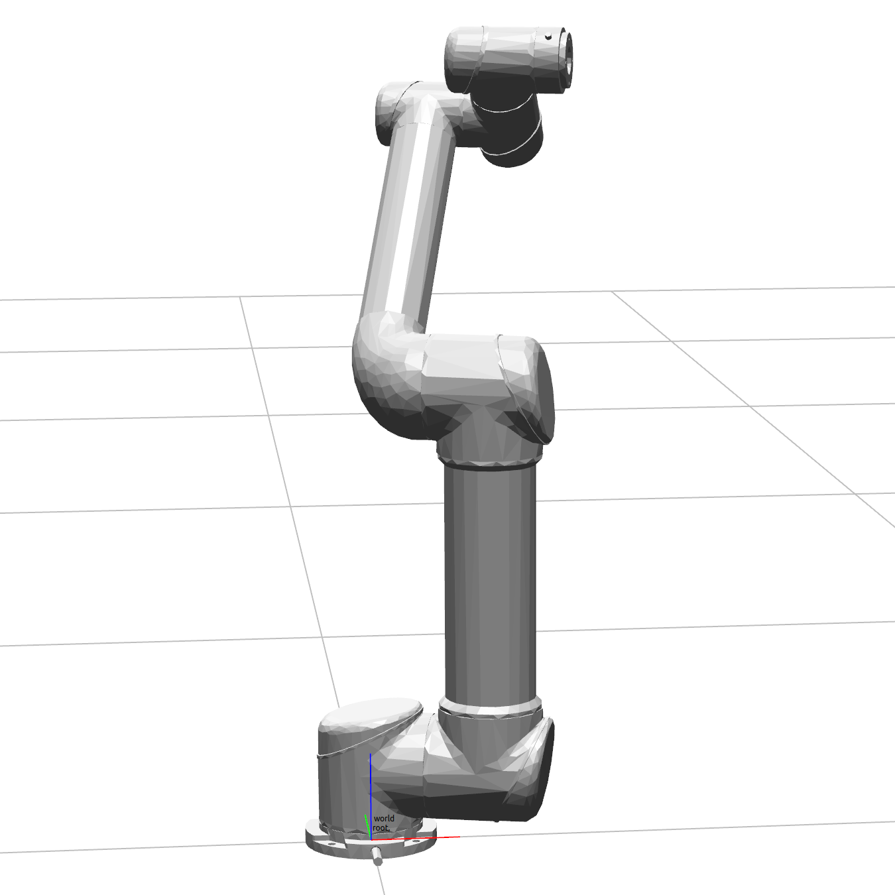

# Jrl

Jrl ('Jeremy's robotics library') is a robotics library containing robot models for popular robots as well as efficient, pytorch based *parallelized* implementations of forward kinematics, inverse kinematics, end effector jacobian, and robot-robot + robot-environment collision checking. This library is used as the backbone for the [IKFlow](https://github.com/jstmn/ikflow) and [CppFlow](https://github.com/jstmn/cppflow) codebases.


### Robots

Robot models include the following:

| Robot                       |  Class name |   Alias |
|-----------------------------| ---------   |  ---------   |
| Franka Panda                |  Panda      |   `panda`      |
| Fetch                       |  Fetch      |   `fetch`      |
| Fetch - Arm (no lift joint) |  FetchArm   |   `fetch_arm`   |
| Kuka LBR IIWA7              |  Iiwa7      |   `iiwa7`      |
| Flexiv Rizon 4              |  Rizon4     |   `rizon4`     |
| Ur5                         |  Ur5        |   `ur5`        |

Robots can easily be visualized with `python scripts/visualize_robot.py --robot_name=<alias>`, where `<alias>` is one from the table above.

<table>
  <tr>
    <td><pre>panda</pre></td>
    <td><pre>iiwa7</pre></td>
    <td><pre>iiwa14</pre></td>
  </tr>
  <tr>
    <td><pre>fetch</pre></td>
    <td><pre>rizon4</pre></td>
    <td><pre>ur5</pre></td>
  </tr>
</table>


### Functionality

Available operations include (all part of the `Robot` class):

| function                           | description                                                                  |
|--------------------------------------------------------|-----------------------------------------------------------------------------------------------|
| `forward_kinematics()`                           | (batched) forward kinematics                                                                  |
| `jacobian()`                                  | (batched) Jacobian of the manipulators forward kinematics map (w.r.t. joint angles)           |
| `inverse_kinematics_step_levenburg_marquardt()` | (batched) Inverse kinematics step using Levenburg-Marquardt                                   |
| `inverse_kinematics_step_jacobian_pinv()`            | (batched) Inverse kinematics step using the jacobian pseudo-inverse method                    |
| `self_collision_distances()`                     | (batched) Pairwise distance between each link of the robot                                    |
| `self_collision_distances_jacobian()`            | (batched) Jacobian of `self_collision_distances()` w.r.t. joint angles                  |
| `env_collision_distances()`                      | (batched) Pairwise distance between each link of the robot and each cuboid in the environment |
| `env_collision_distances_jacobian()`             | (batched) Jacobian of `env_collision_distances()` w.r.t. joint angles                   |


### Quickstart code

This code will load a Panda robot model and then run forward and inverse kinematics on randomly sampled configs. See demo.py for the complete script, which includes robot-robot and robot-environment collision checking.

```python
from jrl.robots import Panda
from jrl.evaluation import pose_errors_cm_deg
import torch

def assert_poses_almost_equal(poses_1, poses_2):
    pos_errors_cm, rot_errors_deg = pose_errors_cm_deg(poses_1, poses_2)
    assert (pos_errors_cm.max().item() < 0.01) and (rot_errors_deg.max().item() < 0.1)

robot = Panda()
joint_angles, poses = robot.sample_joint_angles_and_poses(n=5, return_torch=True) # sample 5 random joint angles and matching poses

# Run forward-kinematics
poses_fk = robot.forward_kinematics(joint_angles) 
assert_poses_almost_equal(poses, poses_fk)

# Run inverse-kinematics
ik_sols = joint_angles + 0.1 * torch.randn_like(joint_angles) 
for i in range(5):
    ik_sols = robot.inverse_kinematics_step_levenburg_marquardt(poses, ik_sols)
assert_poses_almost_equal(poses, robot.forward_kinematics(ik_sols))
```


Note: This project uses the `w,x,y,z` format for quaternions.

## Installation

Clone the repo and install with poetry. Don't use the version on pypi - it will remain out of date until this project hardens
```
git clone https://github.com/jstmn/jrl.git && cd jrl/
poetry install --without dev
# or:
poetry install # includes dev dependencies, like the linter
```


## Acknowledgements
* [klampt](https://github.com/krishauser/Klampt) is used as a visualizer, for testing the Jrl FK / jacobian calculations, and for single configuration collision checking
* [David Millard](https://github.com/dmillard) developed the collision checking functionality, improved the efficiency of the FK code, and wrote the jacobian function.